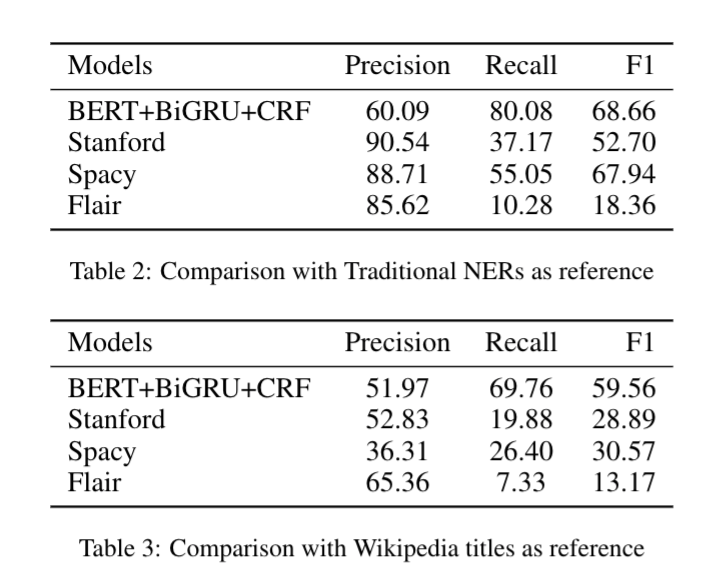
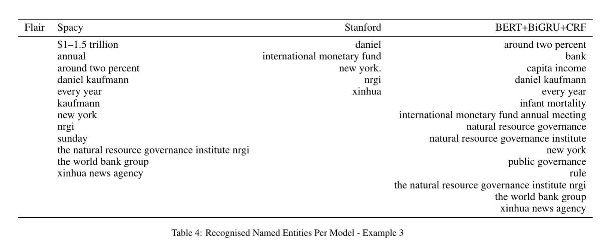
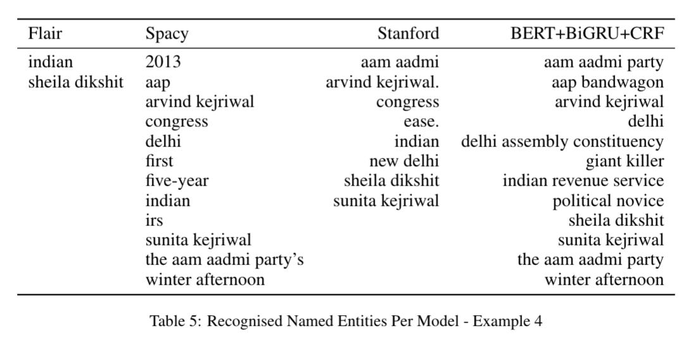

# Detecting Potential Topics In News Using BERT, CRF and Wikipedia

### Abstract
For a news content distribution platform, Named Entity Recognition is a pivotal task for building better user recommendation and notification algorithms. Apart from identifying names, locations, organisations from the news for 13+ Indian languages and use them in  algorithms, we also need to identify n-grams which do not necessarily fit in the definition of Named-Entity, yet important. For example, "me too movement", "beef ban", "alwar mob lynching". In this exercise, given an English language text, we are trying to detect case-less names, locations, organisations and important n-grams  which convey important information and can be used as topics and/or hashtags. Model built using Wikipedia titles data, private English news corpus and BERT-Multilingual pre-trained model, Bi-GRU and CRF architecture, shows promising results when compared with industry best Flair, Spacy and Stanford-caseless-NER.

### Metrics on Validation Set

### Example 1

### Example 2

### Data Files
* Sample Train Data File

    => FILE : sample_train_data.tsv.gz
    
* Cased NERs output

    => FILE : sample_english_news.out.limited

* Sample Model output 

    => FILE : english_sample_news.tsv
    
* All possible NERs for benchmark files 

    => all_possible_ner_set.txt
    
* Models Output Counts 

    => FILE : benchmark_file1.tsv, benchmark_file11.tsv
    
    => TAB Separated
    
    => COLUMNS : text, actual_ner_count, curr_model_match, curr_model_count_total, curr_stanford_match, curr_stanford_count_total, curr_spacy_match, curr_spacy_count_total, curr_flair_match, curr_flair_count_total
    
* Reference wikipedia titles for given validation set 

    => all_possible_wiki_title_matches.txt 
    
* Benchmark outputs for all models
    
    => benchmark_file_222.tsv
    
    => TAB separated

    => COLUMNS : text, actual_ner_list, model_ner_list, stanford_ner_list, spacy_ner_list, flair_ner_list
    
    
